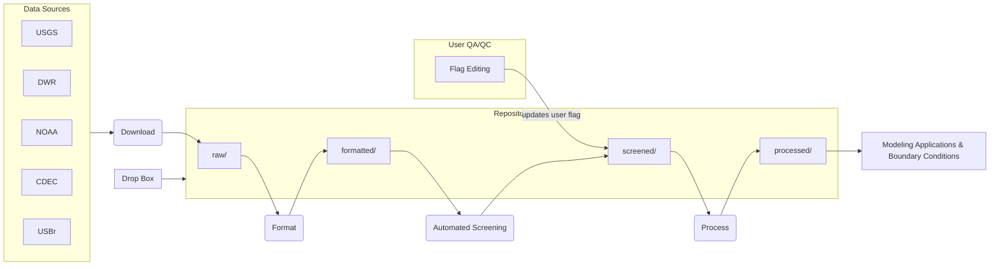
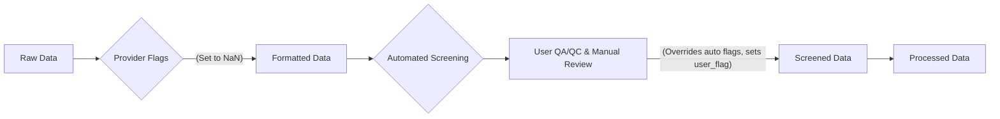

# dms_datastore

Delta Modeling Section Datastore provides tools for downloading and managing continuous data. This repository is a work in progress. 

## Table of Contents
- [Overview](#overview)
- [Data Repository Structure](#data-repository-structure)
- [Data Quality and Flags](#data-quality-and-flags)
- [Data Screening and Error Detection Methods](#data-screening-and-error-detection-methods)
- [Metadata and Station Concepts](#metadata-and-station-concepts)
- [File Naming Conventions](#file-naming-conventions)
- [Units and Standardization](#units-and-standardization)
- [Data Fetching and Priority](#data-fetching-and-priority)
- [Configuration System](#configuration-system)
- [Accessing Datastore Data](#accessing-datastore-data)
- [Challenges and Exceptions](#challenges-and-exceptions)
- [Installation](#installation)

## Overview

The overarching goal of this data organization effort is to retrieve data from data providers and store in a common format, validate data (screened) and for use in applications such as boundary conditions (filled/aggregated or derived data), which is referred to as "processed" data. The system aims to move away from manually manipulated data in favor of standardized formats for programmatic access.

## Data Repository Structure

The centralized data repository is housed in a file system-based share at 

`<internal shared directory server>\Modeling_Data\continuous_station_repo`. 

A mirrored copy is available at http://tinyurl.com/dmsdatastore.

The system processes data through distinct stages:

1. **Raw**: Data is stored exactly "as downloaded" without transformation or unit changes. This includes data fetched from various sources in their original formats, even if proprietary or unusual. Raw files are unique per datastream per time block.

2. **Formatted**: Data in this stage adheres to file naming conventions and includes prescribed metadata. While the original intention for unit conversion at this stage was questioned, it's noted that units were not typically changed here.

3. **Screened**: This stage incorporates data that has undergone quality assurance and quality control (QA/QC) processes, including flagging data rejected by providers or users. At this stage, units are standardized and consistent across data.

4. **Processed**: This represents the final stage where data may have been filled by algorithms and is ready for specific applications like boundary conditions, where smoothing or no missing values are required. These files are not necessarily unique in the same way as raw or screened data.

### Data Repository Workflow



### User Access

Users typically have write access only to "incoming" subdirectories within `raw`, `screened`, and `processed` directories, with submissions formatted correctly then being ingested into the main, read-only directories. Users are generally not expected to access raw data directly; `formatted` data allows review of original downloaded values, and `screened` data includes user flags and consistent units.

## Data Quality and Flags

Data quality is tracked through several concepts:

- **Status**: Data can be "Accepted" (flagged by provider or with a QAQC flag indicating attention) or "Provisional" (from a real-time source). The system prioritizes data from the "provider of record" (e.g., Water Data Library - WDL) over real-time sources (e.g., CDEC) for "accepted" data, while provisional data may come from real-time backups.

- **Quality**: This includes "Provider quality" and "User quality". Provider flags indicating bad data are honored and lead to values being set to NaN (Not a Number). "User quality" allows the project's QA/QC process to signal bad data while respecting original values. A `user_flag` column in screened data indicates anomalous data, where `1` means anomalous and `0` (or `NA`) means the anomaly was overridden by a user.

### Data Quality Flow



## Data Screening and Error Detection Methods

The `auto_screen.py` module in `dms_datastore` performs YAML-specified screening protocols on time series data. Key screening methods include:

- **dip_test(ts, low, dip)**: Checks for anomalies based on dips below a threshold.
- **repeat_test(ts, max_repeat, lower_limit=None, upper_limit=None)**: Identifies anomalies due to values repeating more than a specified number of times.
- **short_run_test(ts, small_gap_len, min_run_len)**: Flags small clusters of valid data points surrounded by larger gaps as anomalies.

Additional error detection methods from `vtools3` include:

- **nrepeat(ts)**: Returns the length of consecutive runs of repeated values.
- **threshold(ts, bounds, copy=True)**: Masks values outside specified bounds.
- **bounds_test(ts, bounds)**: Detects anomalies based on specified bounds.
- **median_test(ts, ...) / med_outliers(ts, ...)**: Detects outliers using a median filter.
- **median_test_oneside(ts, ...)**: Uses a one-sided median filter for outlier detection.
- **median_test_twoside(ts, ...)**: Similar to `med_outliers` but uses a two-sided median filter.
- **gapdist_test_series(ts, smallgaplen=0)**: Fills small gaps to facilitate gap analysis.
- **steep_then_nan(ts, ...)**: Identifies outliers near large data gaps.
- **despike(arr, n1=2, n2=20, block=10)**: Implements an algorithm to remove spikes from data.

## Metadata and Station Concepts

The system defines clear concepts for organizing time series data:

- **Station**: A well-defined concept tied to a (location, institution) pair, acknowledging that physical locations may vary slightly and different agencies at the same approximate location may have subtly different platforms. The `station_dbase.csv` contains station information like ID, agency ID, name, latitude, and longitude. These locations are corrected to fit the SCHISM mesh.

- **Sublocation**: Used when a "station" doesn't uniquely describe a datastream, such as top/bottom sensors or different programs within the same agency measuring the same variable. The `station_subloc_new.csv` table is used to define sublocations. The `subloc` concept generalizes depths and other ambiguities.

- **Datastream**: This term describes a single sensor and is uniquely identified by the combination of (station, sublocation, variable).

## File Naming Conventions

A simplified file naming convention is used for data files:
`agency_dwrID@subloc_agencyID_variable_YYYY_9999.csv`

For example: `usgs_sjj@bgc_11337190_turbidity_2016_2020.csv`

Components include:

- **agency**: The agency that collects the data, potentially including a high-level program name (e.g., `dwr_des`).
- **dwr id and sublocation**: The DWR ID from `stations_utm.csv` and the `subloc` from `station_subloc_new.csv`, separated by an `@` sign if a sublocation exists.
- **agency_id**: The identifier used by the agency (e.g., `11337190` for USGS).
- **variable**: The variable name using the project's standardized naming convention (e.g., `turbidity`, `temp`).
- **_YYYY_9999**: Indicates the time shard, with `9999` representing "until now".

File formats use `#` for comments, `,` as a separator, and ISO/CF compliant timestamps (e.g., `2009-02-10T00:00`). Metadata is included as key-value pairs in the header.

## Units and Standardization

The system aims for standardization of variables and units:

- **CF Compliance**: Variable names and units are intended to be CF (Climate and Forecast) compliant wherever possible.
- **Unit Handling**: The "screened" data should have consistent units. The standard practice for stage and flow is feet and cubic feet per second, respectively, while SI units are used for everything else like temperature.
- **PSU Exception**: Practical Salinity Unit (PSU) is noted as an exception, as it's technically a ratio and not a true unit.
- **Specific Conductivity (EC)**: This is the standard way salinity data is collected and is always normalized to 25°C.

## Data Fetching and Priority

Data is fetched through download scripts (`download_noaa`, `download_cdec`, `download_nwis`, `download_des.py`). The `auto_screen` process uses `custom_fetcher` functions to retrieve data.

The system handles cases where data for the same station comes from different sources. The `src_priority` mechanism in `read_ts_repo` ensures that data from higher-priority sources is preferred.

### Dropbox Data Processing

The Dropbox Data Processing System provides a mechanism for importing ad-hoc or one-off data files into the repository. This is particularly useful for integrating data that was sourced as files rather than through automated downloads, or for processing data from non-standard sources.

The system uses a YAML configuration file (`dropbox_spec.yaml`) to define data sources, collection patterns, and metadata handling rules. The `dropbox_data.py` script processes these configurations to locate, transform, and store the data in the standardized repository format.

See [README-dropbox.md](README-dropbox.md) for detailed documentation on this system.

## Configuration System

The datastore uses a configuration system based on YAML files and Python modules to manage various aspects of data handling, station metadata, and screening processes.

### Configuration Files

The main configuration files are:

- **dstore_config.yaml**: The central configuration file that defines paths to critical datasets, repository locations, source priorities, and screening configurations.
- **dstore_config.py**: Python module that reads the YAML configuration and provides functions to access various configuration elements.

#### Station Database and Variable Mappings

The configuration system points to several key data files:

- **station_dbase.csv**: Contains the master database of all stations with their metadata including:
  - `id`: Internal unique identifier for each station
  - `agency_id`: The ID used by the agency that operates the station
  - Geographic coordinates, station name, and other metadata

- **variable_mappings.csv**: Maps between agency-specific variable codes/names and the standardized variable naming used within the datastore system.

- **variable_definitions.csv**: Defines standard variables used in the system along with their units and descriptive information.

- **station_subloc.csv**: Contains information about sublocations (e.g., depths, sensor positions) for stations where simple station ID is insufficient.

### Source Priority Configuration

The `source_priority` section in `dstore_config.yaml` defines the preferred data sources for each agency:

```
source_priority:
  ncro: ['ncro','cdec']
  dwr_ncro: ['ncro']
  des: ['des']
  dwr_des: ['des']
  usgs: ['usgs']
  noaa: ['noaa']
  usbr: ['cdec']
  dwr_om: ['cdec']
  dwr: ['cdec']
  ebmud: ['usgs','ebmud','cdec']
```

This configuration specifies the priority order for data sources when multiple sources exist for the same station. For example, for EBMUD stations, the system will first try to use USGS data, then EBMUD's own data, and finally fall back to CDEC if neither of the higher priority sources are available.

### Screen Configuration

The screening configuration (referenced by `screen_config` and `screen_config_v20230126` in dstore_config.yaml) specifies automated data quality checking rules. The screening configuration YAML file contains rule sets for:

1. **Bounds checking**: Defining acceptable minimum and maximum values for variables
2. **Spike detection**: Parameters for identifying and flagging data spikes
3. **Repetition checking**: Rules for flagging suspicious repetitions in data
4. **Custom screening functions**: Advanced screening algorithms for specific data types

The `auto_screen.py` module applies these rules to incoming data to flag potential quality issues automatically, which can later be reviewed by users.

### Using the Configuration System

The `dstore_config.py` module provides several functions to interact with the configuration:

- `station_dbase()`: Returns the station database as a pandas DataFrame
- `sublocation_df()`: Returns the sublocations database
- `configuration()`: Returns the entire configuration dictionary
- `get_config()` or `config_file()`: Returns the path to a specific configuration file

The module implements caching to avoid repeatedly loading the same configuration files.

## Accessing Datastore Data

The `read_ts_repo` function is the primary way to access data from the datastore. This function handles the complex task of finding the appropriate data files, prioritizing sources based on the configuration, and returning the data as a pandas DataFrame.

### Using the `read_ts_repo` Function

The `read_ts_repo` function requires station identification and variable information to retrieve data. It handles file path construction, source prioritization, and data consolidation automatically.

Basic syntax:
```python
from dms_datastore.read_multi import read_ts_repo

# Basic usage - retrieve data for a station and variable
data = read_ts_repo(station_id="sjj", variable="flow")

# With sublocation - for stations where position matters
data = read_ts_repo(station_id="msd", variable="elev", subloc="bottom")

# Specifying date ranges (after loading)
data = read_ts_repo(station_id="mrz", variable="elev", subloc="upper").loc[
    pd.Timestamp(2018, 1, 1):pd.Timestamp(2023, 1, 1)
]

# With metadata
data_with_meta = read_ts_repo(station_id="sjj", variable="flow", meta=True)

# With custom source priority (overriding defaults from config)
data = read_ts_repo(station_id="sjj", variable="flow", src_priority=["usgs", "cdec"])

# With custom repository location
data = read_ts_repo(station_id="msd", variable="elev", repo="/path/to/custom/repo")
```

### Function Parameters

- **station_id**: Station identifier as defined in the station database.
- **variable**: The variable name using standardized naming (e.g., "flow", "elev", "temp").
- **subloc**: Optional sublocation identifier (e.g., "bottom", "upper", "bgc").
- **repo**: Optional repository location. If None, uses the default from configuration.
- **src_priority**: Source priority list. If "infer", derives from configuration based on station type.
- **meta**: If True, returns metadata along with the data.
- **force_regular**: Force the returned time series to have regular time intervals.

### Example: Data Retrieval and Processing

```python
import pandas as pd
from dms_datastore.read_multi import read_ts_repo
import matplotlib.pyplot as plt

# Get flow data for San Joaquin at Jersey Point
flow_data = read_ts_repo("sjj", "flow")

# Get the same data but with a specific sublocation
flow_data = read_ts_repo("sjj", "flow", subloc="bgc")

# Filter to a specific time period
start_date = pd.Timestamp("2020-01-01")
end_date = pd.Timestamp("2020-12-31") 
flow_period = flow_data.loc[start_date:end_date]

# Basic visualization
plt.figure(figsize=(12, 6))
plt.plot(flow_period.index, flow_period.values)
plt.title("San Joaquin River Flow at Jersey Point (2020)")
plt.xlabel("Date")
plt.ylabel("Flow (cfs)")
plt.grid(True)
plt.tight_layout()
plt.show()
```

### Caching Data Access

For repeated access to the same data, especially when additional processing is involved, the datastore provides a caching mechanism through the `@cache_dataframe` decorator:

```python
from dms_datastore.read_multi import read_ts_repo
from dms_datastore.caching import cache_dataframe

@cache_dataframe()
def get_filtered_flow(station, variable):
    """Retrieve and process flow data with caching for improved performance."""
    # Read data from repository
    data = read_ts_repo(station, variable)
    
    # Perform some processing
    data = data.interpolate(method='linear', limit=4)
    
    # Calculate daily averages
    daily = data.resample('D').mean()
    
    return daily

# First call will read from repository (slower)
daily_flow = get_filtered_flow(station="sjj", variable="flow")

# Subsequent calls will use cached data (much faster)
daily_flow = get_filtered_flow(station="sjj", variable="flow")
```

## Challenges and Exceptions

Several challenges and workarounds are identified:

- **WDL Station IDs**: WDL station IDs may not have the same `station_id` due to appended "00" or "Q". The solution is to use an internal alias as the `station_id` to ensure uniqueness.
- **SWP/CVP Exports**: These exports are calculated differently for hourly and instantaneous values, leading to them being distinct data sets. The solution is to treat these different calculations as "sublocations".
- **USGS Multiple Instruments**: USGS may have multiple instruments measuring the same variable for one `station_id` due to different programs or sublocations. The `/raw` directory can store these dual versions for QA/QC, though the "processed" set should ideally be unified.

## Installation

```bash
git clone https://github.com/CADWRDeltaModeling/dms_datastore
conda env create -f environment.yml # should create a dms_datastore and pip install the package
# alternatively, pip install -e . after running the above command if you want to develop the package
conda activate dms_datastore
```
